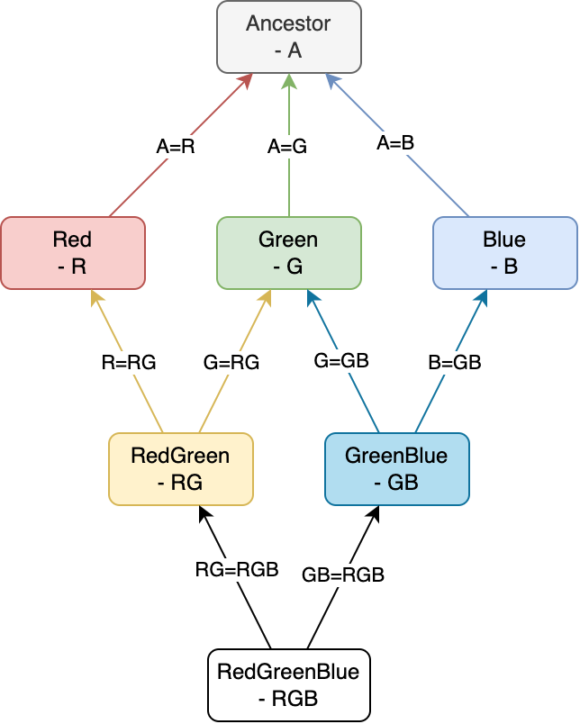
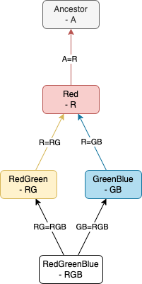

# Rust double diamond trait error

Repository to study and reference the use of the error raised when using a double diamond trait dependency.

You can find a [Rust playground with the code to reproduce this issue here](https://play.rust-lang.org/?version=stable&mode=debug&edition=2024&gist=7050b0182982e8cd05d4089a4b7475fe).

I reported this issue on the [Rust GitHub Repo](https://github.com/rust-lang/rust/issues/139486), so consider checking that one out for potential updates. It seems like it may be fixed [`-Znext-solver`](https://github.com/rust-lang/rust/issues/107374) will be merged into the stable version of Rust in the future. At this time, you can see the error disappears when using the `-Znext-solver` flag:

```bash
RUSTFLAGS="-Znext-solver" cargo check
```

## The problem

The double diamond trait error appears whenever a trait dependency pattern analogous to the one illustrated
in the figure below is used. More specifically, whenever a child trait with associated types has to bind the
associated types of the parents to its own.



In code, this looks like:

```rust
pub trait Ancestor {
    type A;
}

pub trait Red: Ancestor<A = <Self as Red>::R> {
    type R;
}

pub trait RedGreen: Red<R = <Self as RedGreen>::RG> {
    type RG;
}

pub trait GreenBlue: Red<R = <Self as GreenBlue>::GB> {
    type GB;
}

pub trait RedGreenBlue:
    RedGreen<RG = <Self as RedGreenBlue>::RGB> + GreenBlue<GB = <Self as RedGreenBlue>::RGB>
{
    type RGB;
}
```

you can execute this code by running `cargo test` in this repository, and it will yield the following error:

```rust
 --> src/../README.md:41:1
   |
28 | / pub trait RedGreenBlue:
29 | |     RedGreen<RG = <Self as RedGreenBlue>::RGB> + GreenBlue<GB = <Self as RedGreenBlue>::RGB>
   | |____________________________________________________________________________________________^ cannot infer type
   |
   = note: cannot satisfy `<Self as Red>::R == _`

error[E0284]: type annotations needed: cannot satisfy `<Self as Red>::R == <Self as RedGreenBlue>::RGB`
  --> src/../README.md:42:5
   |
29 |     RedGreen<RG = <Self as RedGreenBlue>::RGB> + GreenBlue<GB = <Self as RedGreenBlue>::RGB>
   |     ^^^^^^^^^^^^^^^^^^^^^^^^^^^^^^^^^^^^^^^^^^ cannot satisfy `<Self as Red>::R == <Self as RedGreenBlue>::RGB`
   |
note: required by a bound in `RedGreen`
  --> src/../README.md:33:25
   |
20 | pub trait RedGreen: Red<R = <Self as RedGreen>::RG> + Blue<B = <Self as RedGreen>::RG> {
   |                         ^^^^^^^^^^^^^^^^^^^^^^^^^^ required by this bound in `RedGreen`

error[E0284]: type annotations needed
  --> src/../README.md:44:5
   |
31 |     type RGB;
   |     ^^^^^^^^ cannot infer type
   |
   = note: cannot satisfy `<Self as Red>::R == _`

error: aborting due to 3 previous errors
```

I welcome any suggestions on how to solve this problem. It seems, at least to the humble opinion of my colleagues
and myself, a potential limitation of the current Rust type system. What do you think?

## Simplified example

The traits `Red`, `Blue`, and `Green` are not necessary to reproduce the error, as they can all be grouped into a single
trait - we will arbitrarily call it `Red`. We illustrate this in the following diagram:



The following code will yield the same error as the one above:

```rust
pub trait Ancestor {
    type A;
}

pub trait Red: Ancestor<A = <Self as Red>::R> {
    type R;
}

pub trait Blue: Ancestor<A = <Self as Blue>::B> {
    type B;
}

pub trait Green: Ancestor<A = <Self as Green>::G> {
    type G;
}

pub trait RedGreen: Red<R = <Self as RedGreen>::RG> + Blue<B = <Self as RedGreen>::RG> {
    type RG;
}

pub trait GreenBlue: Red<R = <Self as GreenBlue>::GB> + Green<G = <Self as GreenBlue>::GB> {
    type GB;
}

pub trait RedGreenBlue:
    RedGreen<RG = <Self as RedGreenBlue>::RGB> + GreenBlue<GB = <Self as RedGreenBlue>::RGB>
{
    type RGB;
}
```
